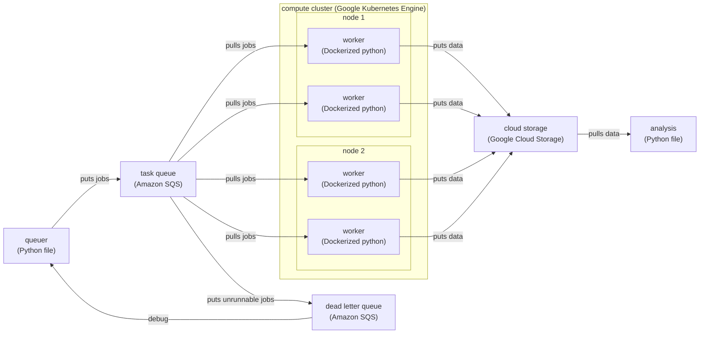

# cloud-workflow-mwe

Minimal working example for cloud workflow using CAVE, Amazon SQS, Google Cloud Storage, etc.

## Diagram



## CAVEclient

From a fresh virtual environment,

```
pip install caveclient
```

Once `caveclient` is installed, make sure authentication is set up.

```
import caveclient as cc
client = cc.CAVEclient()
auth = client.auth
auth.get_new_token()
```

Follow the instructions that pop up. This will involve something like

```
auth.save_token(token=<your new token>)
```

## Google Cloud Storage

Currently, authentication is done using service accounts. You'll need an administrator to give you
the public/private keys for a service account, likely with read/write access to a bucket.

## Amazon SQS

Make sure that your `aws-secret.json` is set. This should look something like this:

```
{
    "AWS_ACCESS_KEY_ID": "<your access key ID>",
    "AWS_SECRET_ACCESS_KEY": "<your secret access key ID>",
    "AWS_DEFAULT_REGION": "us-west-1"
}
```

Assuming you have access to SQS, you can find this information from the AWS console by
clicking on the account name in the top-right corner -> "Security credentials" -> "Access keys" ->
"Create access key". You will be able to see the access key and secret access key on the page that pops up.

## Docker

## Google Kubernetes Engine
