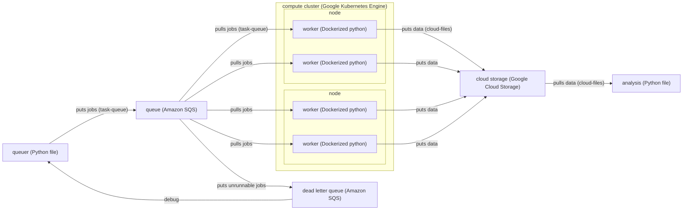

# Cloud task-queue workflow <!-- omit in toc -->

Documenting tips and tricks for cloud workflow using CAVE, Amazon SQS, Google Cloud Storage, etc.

- [Diagram](#diagram)
- [CAVEclient](#caveclient)
- [Google Cloud Storage](#google-cloud-storage)
- [Amazon SQS](#amazon-sqs)
- [Docker](#docker)
- [Google Kubernetes Engine](#google-kubernetes-engine)
- [Debugging, tuning, and superstitions](#debugging-tuning-and-superstitions)

## Diagram



## CAVEclient

From a fresh virtual environment,

```
pip install caveclient
```

Once `caveclient` is installed, make sure authentication is set up.

```
import caveclient as cc
client = cc.CAVEclient()
auth = client.auth
auth.get_new_token()
```

Follow the instructions that pop up. This will involve something like

```
auth.save_token(token=<your new token>)
```

## Google Cloud Storage

Currently, authentication is done using service accounts. You'll need an administrator to give you
the public/private keys for a service account, likely with read/write access to a bucket.

## Amazon SQS

Make sure that your `aws-secret.json` is set. This should look something like this:

```
{
    "AWS_ACCESS_KEY_ID": "<your access key ID>",
    "AWS_SECRET_ACCESS_KEY": "<your secret access key ID>",
    "AWS_DEFAULT_REGION": "us-west-1"
}
```

Assuming you have access to SQS, you can find this information from the AWS console by
clicking on the account name in the top-right corner -> "Security credentials" -> "Access keys" ->
"Create access key". You will be able to see the access key and secret access key on the page that pops up.

## Docker
(Incomplete)

To build (from folder above):
`docker buildx build --platform linux/amd64 -t cloud-mesh . -f ./cloud-mesh/Dockerfile`

To run:
`docker run --rm --platform linux/amd64 -v /Users/ben.pedigo/.cloudvolume/secrets:/root/.cloudvolume/secrets cloud-mesh`

To tag:
`docker tag cloud-mesh bdpedigo/cloud-mesh:v0`

To push:
`docker push bdpedigo/cloud-mesh:v0`

## Google Kubernetes Engine
(Incomplete)

Making a cluster:
`sh ./make_cluster.sh`

Configuring a cluster:
`kubectl apply -f kube-task.yml`

Monitor the cluster:
`kubectl get pods`

Watch the logs in real-time:
`kubectl logs -f <pod-name>`


## Debugging, tuning, and superstitions

- Once you get to this point where the pods are set up and running, it is common to see issues in the Google Cloud Console like "PodUnschedulable", "CrashLoopBackOff", etc. This is usually due to the fact that the pods are requesting more resources than are available. You can see the resources available and requested on the nodes by running `kubectl describe nodes` from the command line. This is a great starting point for viewing computational resources. The output will look something like this:

```bash
Non-terminated Pods:          (24 in total)
  Namespace                   Name                                                        CPU Requests  CPU Limits  Memory Requests  Memory Limits  Age
  ---------                   ----                                                        ------------  ----------  ---------------  -------------  ---
  default                     myelin-highmem-6486f54774-4lzv9                             300m (7%)     600m (15%)  2Gi (7%)         4Gi (14%)      18m
  default                     myelin-highmem-6486f54774-5sccg                             300m (7%)     600m (15%)  2Gi (7%)         4Gi (14%)      18m
  default                     myelin-highmem-6486f54774-5ssjk                             300m (7%)     600m (15%)  2Gi (7%)         4Gi (14%)      18m
  default                     myelin-highmem-6486f54774-8pmcj                             300m (7%)     600m (15%)  2Gi (7%)         4Gi (14%)      18m
  default                     myelin-highmem-6486f54774-j4f5h                             300m (7%)     600m (15%)  2Gi (7%)         4Gi (14%)      18m
  default                     myelin-highmem-6486f54774-jrhx7                             300m (7%)     600m (15%)  2Gi (7%)         4Gi (14%)      18m
  default                     myelin-highmem-6486f54774-l4vvf                             300m (7%)     600m (15%)  2Gi (7%)         4Gi (14%)      18m
  default                     myelin-highmem-6486f54774-lncng                             300m (7%)     600m (15%)  2Gi (7%)         4Gi (14%)      18m
  default                     myelin-highmem-6486f54774-qzr6v                             300m (7%)     600m (15%)  2Gi (7%)         4Gi (14%)      18m
  default                     myelin-highmem-6486f54774-rs5kw                             300m (7%)     600m (15%)  2Gi (7%)         4Gi (14%)      18m
  default                     myelin-highmem-6486f54774-sdlss                             300m (7%)     600m (15%)  2Gi (7%)         4Gi (14%)      18m
  gmp-system                  collector-v5tc8                                             5m (0%)       0 (0%)      36M (0%)         3032M (10%)    28m
  gmp-system                  gmp-operator-555cdd6cf-q92ss                                1m (0%)       0 (0%)      16M (0%)         2G (6%)        29m
  kube-system                 event-exporter-gke-6cd958b584-tdmbx                         3m (0%)       0 (0%)      100Mi (0%)       0 (0%)         29m
  kube-system                 fluentbit-gke-jb2sx                                         105m (2%)     1 (25%)     230Mi (0%)       565Mi (1%)     28m
  kube-system                 gke-metrics-agent-hk5rk                                     19m (0%)      1 (25%)     155Mi (0%)       190Mi (0%)     28m
  kube-system                 konnectivity-agent-7487c74d59-44ctx                         15m (0%)      1 (25%)     60Mi (0%)        155Mi (0%)     29m
  kube-system                 konnectivity-agent-autoscaler-cb586b6f8-4rfnd               10m (0%)      0 (0%)      10M (0%)         0 (0%)         29m
  kube-system                 kube-dns-6fcdc4946b-vgss9                                   265m (6%)     1 (25%)     140Mi (0%)       240Mi (0%)     30m
  kube-system                 kube-dns-autoscaler-598f8bf5c8-drhpb                        20m (0%)      0 (0%)      10Mi (0%)        0 (0%)         29m
  kube-system                 kube-proxy-gke-myelin-highmem-default-pool-ea2a3025-3c7p    100m (2%)     0 (0%)      0 (0%)           0 (0%)         28m
  kube-system                 l7-default-backend-9f767977f-7qd2d                          10m (0%)      0 (0%)      20Mi (0%)        0 (0%)         29m
  kube-system                 metrics-server-v1.30.3-5cb5c558fb-jprv8                     43m (1%)      43m (1%)    55Mi (0%)        55Mi (0%)      29m
  kube-system                 pdcsi-node-cfqhv                                            10m (0%)      0 (0%)      20Mi (0%)        500Mi (1%)     28m
```

- Note in the example above that there are a bunch of pods in the `gmp-system` and `kube-system` namespaces that you didn't ask for at all! Kubernetes needs it's own pods to manage other pods. Each of these has its own CPU and memory requests. This means that if you are on 4 cores running 8 pods, and you try to give each exactly 500m of CPU, you won't be able to satisfy the request for all pods. Therefore, it's a good idea to request a bit less than what you'd expect from just simple math on how many CPUs you have. Note that this *request* does not necessarily mean that Kubernetes is using that much CPU or memory.
- You don't have to set a CPU limit! This can help with letting pods work as hard as the physical hardware will allow. 
- On the other hand, you *do* need a memory limit, since Kubernetes will kill pods that exceed their memory limit. This is a good thing, since it prevents a single pod from taking down the whole cluster.
- Tons of logs or verbose output like TQDM can clog up memory/storage on the nodes and lead to cryptic crashing events.
- The "memory allocatable" for a node is slightly less than advertised (e.g. 29GB instead of 32GB) so keep this in mind when setting memory requests/limits.
- I highly recommend [K9s](https://github.com/derailed/k9s) for more detailed information about the pods and nodes.
